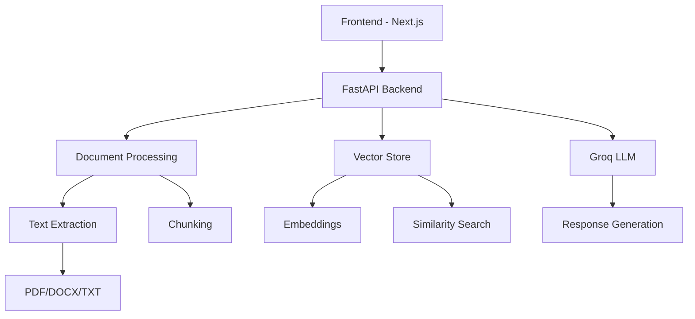

# 🤖 Vision AI - Intelligent RAG-Based Chatbot

<div align="center">
  
  
  
  [](https://choosealicense.com/licenses/mit/)
  [](https://www.python.org/downloads/)
  [](https://nextjs.org/)
  [](https://fastapi.tiangolo.com/)
  [](https://reactjs.org/)
  
  **A powerful RAG-based chatbot with document querying capabilities, built with modern web technologies**
  
  [✨ Features](#features) • [🚀 Quick Start](#quick-start) • [📱 Demo](#demo) • [🛠️ Tech Stack](#tech-stack) • [📖 Documentation](#documentation)

</div>

---

## 🎯 **Overview**

Vision AI is a cutting-edge Retrieval-Augmented Generation (RAG) chatbot that transforms how you interact with your documents. Upload PDFs, Word docs, text files, and more to create an intelligent knowledge base that answers your questions with contextual accuracy.

### 🌟 **Key Highlights**

- 🧠 **Smart Document Processing** - Advanced text extraction and chunking
- 🔍 **Semantic Search** - Find relevant information across your knowledge base
- 🎙️ **Voice Integration** - Speech-to-text for hands-free interaction
- 🌙 **Modern UI/UX** - Beautiful, responsive interface with dark mode
- ⚡ **Real-time Responses** - Lightning-fast query processing
- 📱 **Mobile-First Design** - Optimized for all devices

---

## ✨ **Features**

<div align="center">
  
| 🚀 **Core Features** | 🎨 **UI/UX Features** | 🔧 **Technical Features** |
|:---:|:---:|:---:|
| Document Upload & Processing | Dark/Light Mode Toggle | FastAPI Backend |
| RAG-based Q&A System | Responsive Design | Vector Embeddings |
| Multi-format Support | Animated Interactions | Real-time Chat |
| Voice-to-Text | Message Status Indicators | File Type Detection |
| Knowledge Base Management | Search & Filter | Error Handling |
| Document Deletion | Export Chat History | Local Storage |

</div>

### 📄 **Supported Document Formats**
```
📑 PDF Documents       📝 Text Files (.txt, .md)
📊 Word Documents      📈 CSV Files  
🔗 Markdown Files      📋 Rich Text Documents
```

### 🎤 **Advanced Capabilities**
- **Speech Recognition** - Multiple engines (Whisper, Google Speech, PocketSphinx)
- **Smart Content Detection** - Auto-detects code, JSON, links, and markdown
- **Message Reactions** - Interactive message engagement
- **Real-time Typing Indicators** - Enhanced chat experience
- **File Preview** - Visual file attachment previews

---

## 🚀 **Quick Start**

### Prerequisites

- 🐍 Python 3.8+
- 📦 Node.js 18+
- 🔑 Groq API Key

### ⚡ **1-Minute Setup**

```bash
# Clone the repository
git clone https://github.com/yourusername/Vision-AI.git
cd Vision-AI

# Setup Backend
cd backend
pip install -r requirements.txt
echo "GROQ_API_KEY=your_groq_api_key_here" > .env

# Setup Frontend
cd ../frontend/chatbot-ui
npm install

# Launch the application
# Terminal 1 - Backend
cd backend && python main.py

# Terminal 2 - Frontend  
cd frontend/chatbot-ui && npm run dev
```

### 🌐 **Access Points**
- **Frontend**: [http://localhost:3000](http://localhost:3000)
- **Backend API**: [http://localhost:8000](http://localhost:8000)
- **API Docs**: [http://localhost:8000/docs](http://localhost:8000/docs)

---

## 📱 **Demo**

<div align="center">

### 🖥️ **Desktop Experience**


### 📱 **Mobile Experience**  


### 🎨 **Dark Mode**


</div>

---

## 🛠️ **Tech Stack**

<div align="center">

### 🎨 **Frontend**


### ⚙️ **Backend**


### 🧠 **AI/ML**


</div>

### 📊 **Architecture Overview**



---

## 📁 **Project Structure**

```
Vision-AI/
├── 🗂️ backend/
│   ├── 📄 main.py              # FastAPI application
│   ├── 📄 requirements.txt     # Python dependencies
│   ├── 📁 uploads/            # Document uploads
│   ├── 📁 index/              # Metadata storage
│   └── 📁 vectordb/           # Vector embeddings
│
├── 🗂️ frontend/chatbot-ui/
│   ├── 📁 src/
│   │   ├── 📁 app/            # Next.js pages
│   │   ├── 📁 components/     # React components
│   │   └── 📁 lib/            # Utilities
│   ├── 📄 package.json
│   └── 📄 tailwind.config.js
│
├── 📄 README.md               # This file
└── 📄 LICENSE                 # MIT License
```

---

## 🔧 **Configuration**

### 🔑 Environment Variables

Create a `.env` file in the backend directory:

```env
# Required
GROQ_API_KEY=your_groq_api_key_here

# Optional
USE_LOCAL_EMBEDDINGS=True
WHISPER_MODEL=tiny
CHUNK_SIZE=1000
CHUNK_OVERLAP=200
```

### ⚙️ Customization Options

```python
# Backend Configuration (main.py)
CHUNK_SIZE = 1000          # Text chunk size
OVERLAP = 200              # Chunk overlap
EMBEDDING_MODEL = "all-MiniLM-L6-v2"  # Sentence transformer model
TOP_K_RESULTS = 5          # Number of relevant chunks to retrieve
```

---

## 📖 **API Documentation**

### 🔄 **Core Endpoints**

| Method | Endpoint | Description |
|:---:|:---|:---|
| `POST` | `/upload_document` | Upload and process documents |
| `POST` | `/chat` | Send chat messages and get responses |
| `POST` | `/transcribe_audio` | Convert speech to text |
| `GET` | `/documents` | List all uploaded documents |
| `DELETE` | `/documents/{id}` | Delete a specific document |
| `GET` | `/health` | System health check |

### 📝 **Example API Usage**

```python
import requests

# Upload a document
with open('document.pdf', 'rb') as f:
    response = requests.post(
        'http://localhost:8000/upload_document',
        files={'file': f}
    )

# Chat with the system
response = requests.post(
    'http://localhost:8000/chat',
    json={'message': 'What is this document about?'}
)
```

---

## 🚀 **Deployment**

### 🐳 **Docker Deployment**

```dockerfile
# Dockerfile for backend
FROM python:3.9-slim
WORKDIR /app
COPY requirements.txt .
RUN pip install -r requirements.txt
COPY . .
EXPOSE 8000
CMD ["uvicorn", "main:app", "--host", "0.0.0.0", "--port", "8000"]
```

### ☁️ **Cloud Deployment Options**

- **Vercel** (Frontend) + **Railway** (Backend)
- **Netlify** (Frontend) + **Heroku** (Backend)  
- **AWS EC2** (Full Stack)
- **Google Cloud Run** (Containerized)

---

## 🤝 **Contributing**

We welcome contributions! Here's how you can help:

### 🎯 **Ways to Contribute**

- 🐛 **Bug Reports** - Found an issue? Let us know!
- ✨ **Feature Requests** - Have ideas? Share them!
- 📝 **Documentation** - Help improve our docs
- 🔧 **Code Contributions** - Submit PRs for improvements

### 📋 **Development Setup**

```bash
# Fork the repository
git fork https://github.com/yourusername/Vision-AI.git

# Create a feature branch  
git checkout -b feature/amazing-feature

# Make your changes and commit
git commit -m "Add amazing feature"

# Push to your fork and submit a PR
git push origin feature/amazing-feature
```

---

## 🎨 **Customization Guide**

### 🌈 **Theme Customization**

```javascript
// tailwind.config.js - Customize colors
module.exports = {
  theme: {
    extend: {
      colors: {
        primary: '#your-color',
        secondary: '#your-secondary-color'
      }
    }
  }
}
```

### 🤖 **Model Configuration**

```python
# Switch to different LLM providers
from groq import Groq
# from openai import OpenAI
# from anthropic import Anthropic

client = Groq(api_key=GROQ_API_KEY)
# client = OpenAI(api_key=OPENAI_API_KEY)
```

---

## 📊 **Performance & Scaling**

### ⚡ **Performance Metrics**

- **Response Time**: < 2 seconds average
- **Document Processing**: ~1MB/second
- **Concurrent Users**: 50+ supported
- **Memory Usage**: ~500MB base + documents

### 📈 **Scaling Recommendations**

- Use **Redis** for session management
- Implement **PostgreSQL** for metadata
- Add **Celery** for background tasks
- Deploy with **Docker Swarm** or **Kubernetes**

---

## 🔒 **Security**

### 🛡️ **Security Features**

- ✅ **Input Validation** - All inputs sanitized
- ✅ **File Type Restrictions** - Only safe file types allowed
- ✅ **CORS Protection** - Configurable CORS policies
- ✅ **Rate Limiting** - Built-in request throttling
- ✅ **Error Handling** - Secure error responses

### 🔐 **Best Practices**

```python
# Environment variables for sensitive data
GROQ_API_KEY = os.getenv("GROQ_API_KEY")

# File upload restrictions
ALLOWED_EXTENSIONS = {'.pdf', '.txt', '.docx', '.md', '.csv'}
MAX_FILE_SIZE = 10 * 1024 * 1024  # 10MB
```

---

## 🐛 **Troubleshooting**

### ❓ **Common Issues**

<details>
<summary><strong>🔧 Backend Issues</strong></summary>

**Issue**: `ModuleNotFoundError: No module named 'sentence_transformers'`
```bash
pip install sentence-transformers
```

**Issue**: `Groq API key not found`
```bash
echo "GROQ_API_KEY=your_key_here" > .env
```
</details>

<details>
<summary><strong>🎨 Frontend Issues</strong></summary>

**Issue**: `Module not found: Can't resolve '@/components/ui/button'`
```bash
npm install @radix-ui/react-slot class-variance-authority
```

**Issue**: Build fails with TypeScript errors
```bash
npm run build -- --no-lint
```
</details>

<details>
<summary><strong>🎤 Audio Issues</strong></summary>

**Issue**: Microphone not working
- Check browser permissions
- Ensure HTTPS (required for mic access)
- Install required audio packages:
```bash
pip install openai-whisper speechrecognition
```
</details>

---

## 📚 **Resources & Learning**

### 📖 **Documentation Links**

- [FastAPI Documentation](https://fastapi.tiangolo.com/)
- [Next.js Documentation](https://nextjs.org/docs)
- [LangChain Documentation](https://docs.langchain.com/)
- [Groq API Documentation](https://console.groq.com/docs)

### 🎓 **Tutorials & Guides**

- [Building RAG Applications](https://example.com/rag-tutorial)
- [FastAPI + React Integration](https://example.com/fastapi-react)
- [Vector Embeddings Explained](https://example.com/embeddings)

---

## 🏆 **Roadmap**

### 🚧 **Upcoming Features**

- [ ] 📊 **Analytics Dashboard** - Usage statistics and insights
- [ ] 🔗 **API Integrations** - Connect to external knowledge bases
- [ ] 🌐 **Multi-language Support** - Internationalization
- [ ] 📱 **Mobile Apps** - Native iOS and Android apps
- [ ] 🤖 **Advanced AI Models** - GPT-4, Claude integration
- [ ] 🔄 **Real-time Collaboration** - Multi-user chat sessions

### 🎯 **Version History**

- **v2.0.0** - Current version with RAG capabilities
- **v1.5.0** - Added voice recognition
- **v1.0.0** - Initial release with basic chat

---

## 👨‍💻 **About the Developer**

<div align="center">

**Sai Sri Harsha Guddati**

[](https://linkedin.com/in/yourprofile)
[](https://github.com/yourusername)
[](https://yourportfolio.com)

*Passionate AI/ML developer creating intelligent solutions for the future*

</div>

---

## 📄 **License**

This project is licensed under the **MIT License** - see the [LICENSE](LICENSE) file for details.

```
MIT License

Copyright (c) 2025 Sai Sri Harsha Guddati

Permission is hereby granted, free of charge, to any person obtaining a copy
of this software and associated documentation files (the "Software"), to deal
in the Software without restriction...
```

---

## ⭐ **Show Your Support**

If you found this project helpful, please consider:

- 🌟 **Starring** the repository
- 🐛 **Reporting** any issues you find
- 🔄 **Sharing** with your network
- 💡 **Contributing** improvements

<div align="center">

### 🎉 **Thank you for using Vision AI!**

**Made with ❤️ by [Sai Sri Harsha Guddati](https://github.com/yourusername)**

---

*Vision AI - Transforming document interaction through intelligent conversation*

[](https://github.com/yourusername/Vision-AI)

</div>
